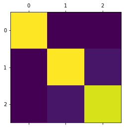

.. code:: ipython3

    pip install Graphviz

.. parsed-literal::

    Requirement already satisfied: Graphviz in /opt/anaconda3/lib/python3.8/site-packages (0.16)
    Note: you may need to restart the kernel to use updated packages.

.. code:: ipython3

    import pandas as pd
    import graphviz
    from sklearn.preprocessing import LabelEncoder
    from sklearn.tree import DecisionTreeClassifier , export_graphviz
    from sklearn.model_selection import train_test_split
    from sklearn.metrics import accuracy_score
    #setting random seed.
    seed = 10

.. code:: ipython3

    from sklearn import datasets
    iris = datasets.load_iris()
    df=pd.read_csv ( '//opt//anaconda3//lib//python3.8//site-packages//sklearn//datasets//data/iris.csv',
                               delimiter=',',
                               header=0,
                               names=['sepal length (cm)','sepal width (cm)',
                                     'petal length (cm)','petal width (cm)','Variety']
                               )
    df.head()

.. raw:: html

    

    
    <table border="1" class="dataframe">
      <thead>
        <tr style="text-align: right;">
          <th></th>
          <th>sepal length (cm)</th>
          <th>sepal width (cm)</th>
          <th>petal length (cm)</th>
          <th>petal width (cm)</th>
          <th>Variety</th>
        </tr>
      </thead>
      <tbody>
        <tr>
          <th>0</th>
          <td>5.1</td>
          <td>3.5</td>
          <td>1.4</td>
          <td>0.2</td>
          <td>0</td>
        </tr>
        <tr>
          <th>1</th>
          <td>4.9</td>
          <td>3.0</td>
          <td>1.4</td>
          <td>0.2</td>
          <td>0</td>
        </tr>
        <tr>
          <th>2</th>
          <td>4.7</td>
          <td>3.2</td>
          <td>1.3</td>
          <td>0.2</td>
          <td>0</td>
        </tr>
        <tr>
          <th>3</th>
          <td>4.6</td>
          <td>3.1</td>
          <td>1.5</td>
          <td>0.2</td>
          <td>0</td>
        </tr>
        <tr>
          <th>4</th>
          <td>5.0</td>
          <td>3.6</td>
          <td>1.4</td>
          <td>0.2</td>
          <td>0</td>
        </tr>
      </tbody>
    </table>
    

.. code:: ipython3

    le = LabelEncoder()
    le.fit(df['Variety'].values)
    y=le.transform(df['Variety'].values)
    X=df.drop('Variety', axis=1).values
    X_train, X_test, y_train, y_test= train_test_split(X, y, test_size=0.34, stratify=y, random_state=seed)

.. code:: ipython3

    tree = DecisionTreeClassifier(criterion='gini',
                                 min_samples_leaf=5,
                                 min_samples_split=5,
                                 max_depth=None,
                                random_state=seed )
    tree.fit(X_train, y_train )
    y_pred = tree.predict(X_test)
    accuracy = accuracy_score(y_test , y_pred)
    print('DecisionTreeClassifier accuracy score: {}'.format(accuracy))

.. parsed-literal::

    DecisionTreeClassifier accuracy score: 0.9615384615384616

.. code:: ipython3

    from sklearn.metrics import confusion_matrix
    import matplotlib.pyplot as plt
    print('Confusion Matrix is')
    print(confusion_matrix(y_test, y_pred))
    cm=confusion_matrix(y_test, y_pred)
    plt.matshow(cm)
    plt.show()

.. parsed-literal::

    Confusion Matrix is
    [[17  0  0]
     [ 0 17  1]
     [ 0  1 16]]

.. code:: ipython3

    from sklearn.metrics import classification_report
    print(classification_report(y_test, y_pred, labels=df['Variety'].unique()))

.. parsed-literal::

                  precision    recall  f1-score   support
    
               0       1.00      1.00      1.00        17
               1       0.94      0.94      0.94        18
               2       0.94      0.94      0.94        17
    
        accuracy                           0.96        52
       macro avg       0.96      0.96      0.96        52
    weighted avg       0.96      0.96      0.96        52
    

.. code:: ipython3

    import pandas as pd 
    data=pd.read_csv('file:///Users/first/Documents/dataset2.csv',                           delimiter=',')
    data

.. raw:: html

    

    
    <table border="1" class="dataframe">
      <thead>
        <tr style="text-align: right;">
          <th></th>
          <th>Outlook</th>
          <th>Temp</th>
          <th>Humidity</th>
          <th>Windy</th>
          <th>Play Golf</th>
        </tr>
      </thead>
      <tbody>
        <tr>
          <th>0</th>
          <td>Rainy</td>
          <td>Hot</td>
          <td>High</td>
          <td>False</td>
          <td>No</td>
        </tr>
        <tr>
          <th>1</th>
          <td>Rainy</td>
          <td>Hot</td>
          <td>High</td>
          <td>True</td>
          <td>No</td>
        </tr>
        <tr>
          <th>2</th>
          <td>Overcast</td>
          <td>Hot</td>
          <td>High</td>
          <td>False</td>
          <td>Yes</td>
        </tr>
        <tr>
          <th>3</th>
          <td>Sunny</td>
          <td>Mild</td>
          <td>High</td>
          <td>False</td>
          <td>Yes</td>
        </tr>
        <tr>
          <th>4</th>
          <td>Sunny</td>
          <td>Cool</td>
          <td>Normal</td>
          <td>False</td>
          <td>Yes</td>
        </tr>
        <tr>
          <th>5</th>
          <td>Sunny</td>
          <td>Cool</td>
          <td>Normal</td>
          <td>True</td>
          <td>No</td>
        </tr>
        <tr>
          <th>6</th>
          <td>Overcast</td>
          <td>Cool</td>
          <td>Normal</td>
          <td>True</td>
          <td>Yes</td>
        </tr>
        <tr>
          <th>7</th>
          <td>Rainy</td>
          <td>Mild</td>
          <td>High</td>
          <td>False</td>
          <td>No</td>
        </tr>
        <tr>
          <th>8</th>
          <td>Rainy</td>
          <td>Cool</td>
          <td>Normal</td>
          <td>False</td>
          <td>Yes</td>
        </tr>
        <tr>
          <th>9</th>
          <td>Sunny</td>
          <td>Mild</td>
          <td>Normal</td>
          <td>False</td>
          <td>Yes</td>
        </tr>
        <tr>
          <th>10</th>
          <td>Rainy</td>
          <td>Mild</td>
          <td>Normal</td>
          <td>True</td>
          <td>Yes</td>
        </tr>
        <tr>
          <th>11</th>
          <td>Overcast</td>
          <td>Mild</td>
          <td>High</td>
          <td>True</td>
          <td>Yes</td>
        </tr>
        <tr>
          <th>12</th>
          <td>Overcast</td>
          <td>Hot</td>
          <td>Normal</td>
          <td>False</td>
          <td>Yes</td>
        </tr>
        <tr>
          <th>13</th>
          <td>Sunny</td>
          <td>Mild</td>
          <td>High</td>
          <td>True</td>
          <td>No</td>
        </tr>
      </tbody>
    </table>
    

.. code:: ipython3

    from sklearn.naive_bayes import GaussianNB, BernoulliNB

.. code:: ipython3

    le = LabelEncoder()
    y = le.fit_transform(data['Play Golf'])
    print(y)
    Windy = le.fit_transform(data['Windy'].values)
    
    
    
    Humidity = le.fit_transform(data['Humidity'].values)
    
    
    
    Temp = le.fit_transform(data['Temp'].values)
    
    
    
    Outlook = le.fit_transform(data['Outlook'].values)

.. parsed-literal::

    [0 0 1 1 1 0 1 0 1 1 1 1 1 0]

.. code:: ipython3

    features=zip(Windy,Humidity,Temp,Outlook)
    features_ls=list(features)
    print(features_ls)

.. parsed-literal::

    [(0, 0, 1, 1), (1, 0, 1, 1), (0, 0, 1, 0), (0, 0, 2, 2), (0, 1, 0, 2), (1, 1, 0, 2), (1, 1, 0, 0), (0, 0, 2, 1), (0, 1, 0, 1), (0, 1, 2, 2), (1, 1, 2, 1), (1, 0, 2, 0), (0, 1, 1, 0), (1, 0, 2, 2)]

.. code:: ipython3

    model=BernoulliNB()
    model.fit(features_ls,y)
    
    predict=model.predict([[1, 0, 1, 1]])
    print("predicted value: ",predict)

.. parsed-literal::

    predicted value:  [0]

